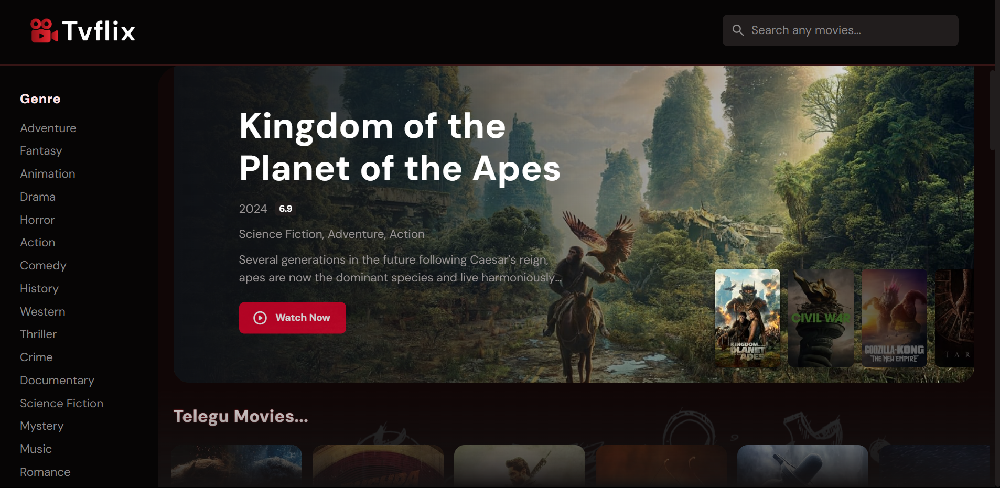

# Movie App 🍿🎥 ✮

TVFlix is a web application that allows users to `discover information about movies.` It utilizes `HTML, CSS, JavaScript, and the TMDb (The Movie Database) API` to provide users with a rich browsing experience.


<br/>

<h1 align="center"> 

<a href="https://tvflix-movie.netlify.app/"><strong> ➥ Live Demo</strong></a>
</h1>
<br/>


# Screenshots 🎉




</br>

# 💻 Tech Stack 🎗️

  &nbsp;  &nbsp;   


<br/>

## Features 🥳
- `Search` ➤ Users can `search for movies by title.`

- `Browse` ➤ Explore `popular and trending movies`. by

  - `New Release`

  - `Category vise`
  - `language vise`
  - `Genre vise `

- `Details` ➤ View `detailed information` about each movie including

    -  `Ratings`

    - `Language available`
    - `Release dete `
    - `Plateform detail`
    - `cast`
    - `crew`

- `Preview` ➤ Users can watch `Trailers and Clips on site` 

---

<br/>

## Deployment 🚀

**To run Tvflix locally**, run this command on your git bash and

 **`Go to api.js file || Create your api_key and paste there`**


`For window 🍃`
```bash
  git clone https://github.com/Prakhar-002/TVFLIX.git
```

`For Linux and macOS 🌿`
```bash
  sudo git clone https://github.com/Prakhar-002/TVFLIX.git
```

<br/>

## API Reference --> TDMB API 📜 

### Default AP 🎦

```JAVASCRIPT
  GET --> https://api.themoviedb.org/3/
```

| Parameter | Type     | My api_key                |
| :-------- | :------- | :------------------------- |
| `api_key` | `string` | **2668db70c618ee1992cb0188a190eb99**|

---

<br/>

### API for **Detail of a MOVIE 🕵️** -->

```JAVASCRIPT
  GET --> ${Default}/${movieId}?api_key=${api_key}&append_to_response=releases,images,videos,casts,translations&include_adult=false
```

---

<br/>

### API for **Search a movie 🔎** -->

```JAVASCRIPT
  GET --> {Default}search/movie?api_key=${api_key}&query=${movie Id}&page=1&include_adult=false
```
---

<br/>

### API for **For Genres 🎬** -->

```JAVASCRIPT
  GET --> {Default}/genre/movie/list?api_key=${api_key}
```

---

<br/>


### API for **Popular Movie 🔥** -->

```JAVASCRIPT
  GET --> {Default}/movie/popular?api_key=${api_key}&page=1&include_adult=false
```

---

<br/>

### API for **Popular HINDI movies 🥰** -->

```JAVASCRIPT
  GET --> {Default}/discover/movie?api_key=${api_key}&page=1&include_adult=false&sort_by=popularity.desc&with_original_language=hi
```
---